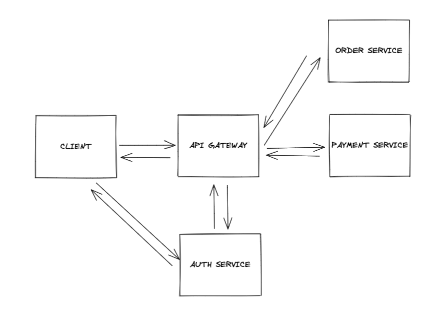
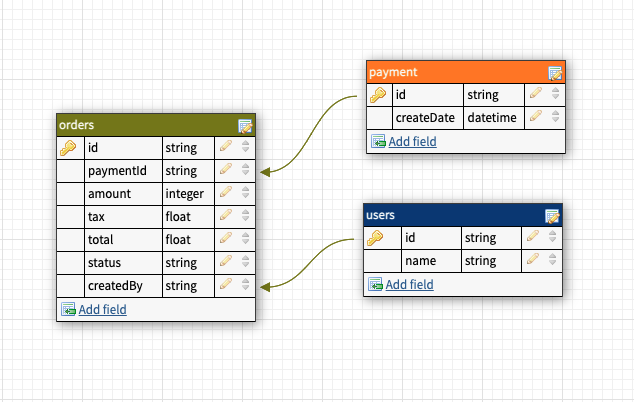
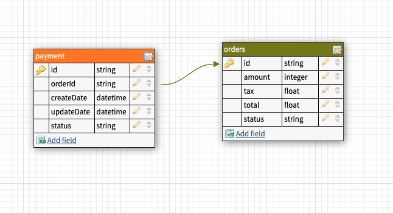
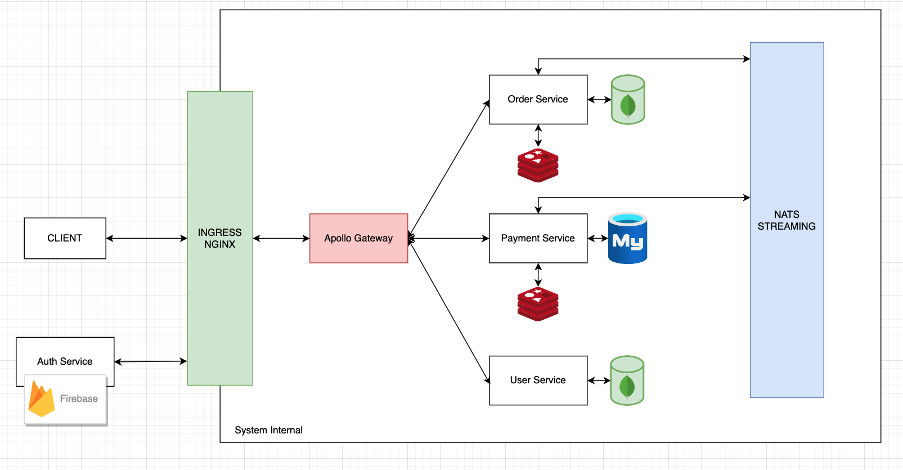

# Technical Test - Readme

## System Design

<hr/>

### 1. High-level design

At a high-level, we need some following services (or components) to handle above requirements:



- **Order Service**: manages customer orders with CRUD operations.
- **Payment Service**: processes customer payment and integrate with 3rd party wallet.
- **Authentication Service**: authenticates customers, integrates with 3rd party identity platform like Facebook, Google... (Dummy implemented).
- **API Gateway**: Route requests to multiple services using a single endpoint. This service allows us to expose multiple services on a single endpoint and route to the appropriate service based on the request.

### 2. High-level design

In this part, we describes considerations for managing data in our architecture. For each service, we discuss data schema and datastore considerations.

In general, we follow the basic principle of microservices is that each service manages its own data. Two services should not share a data store.


#### Order Service

The Order service stores information about all of our customer orders.



- In **Order Service** we will have 2 small replicas of Payment and User tables due to the concept of microservice architecture. Each service has to be isolated to each other.

#### Payment Service

The Payment service stores information about all of customer payment.



- The **Payment Service** also has replica of services for a particular purpose. For this scenario is small data of orders.

### 3. Detailed design



## Software development principles

<hr/>
### KISS (Keep It Simple Stupid)
- Most systems work best if they are kept simple rather than made complex.
- Less code takes less time to write, has less bugs, and is easier to modify.
- > The best design is the simplest one that works - Albert Einstein.

**What applied:** Keep system design and the implementation code simple

### YAGNI (You aren't gonna need it)

- Don't implement something until it is necessary.
- Any work that's only used for a feature that's needed tomorrow, means losing effort from features that need to be done for the current iteration.

**What applied:** Always implement things when we actually need them, never when we just foresee that we need them.

### Separation of Concerns

- Separating a system into multiple distinct microservices, such that each service addresses a separate concern (product, order, shopping cart...).
- AOP to separate of cross-cutting concerns.

### DRY

- Put business rules, long expressions, if statements, math formulas, metadata, etc. in only one place.

### Code For The Maintainer

- Maintenance is by far the most expensive phase of any project.
- Always code as if the person who ends up maintaining your code is a violent psychopath who knows where you live.
- Always code and comment in such a way that if someone a few notches junior picks up the code, they will take pleasure in reading and learning from it.

**What applied:** Comprehensive documentation, make the code clean, add comment for some special intentions.

### Avoid Premature Optimization

- It is unknown upfront where the bottlenecks will be.
- After optimization, it might be harder to read and thus maintain.

**What applied:** Don't optimize until we need to, and only after profiling we discover a bottleneck optimise that.

### Minimise Coupling

- Eliminate, minimise, and reduce complexity of necessary relationships.
- By hiding implementation details, coupling is reduced.

**What applied:** Encapsulation in OOP, DI.

### Inversion of Control

IoC inverts the flow of control as compared to traditional control flow (Don't call us, we'll call you).

- In traditional programming: our custom code makes calls to a library.
- IoC: framework make calls to our custom code.

**What applied:** Spring IoC container with Constructor-Based Dependency Injection for main code and Field-Based Dependency Injection for test code.

### Single Responsibility Principle

Every class should have a single responsibility, and that responsibility should be entirely encapsulated by the class. Responsibility can be defined as a reason to change, so a class or module should have one, and only one, reason to change.

**What applied:** break system into multiple services, each services has only one responsibility. In each services, break into multiple layers, each layers were broken into multiple classes, each class has only one reason to change.

## Application default configuration

<hr/>
To make it easier for development process, we still expose these ports on the local machine to send request directly with services or to view actual data in the data stores. 
In production environment, we leverage the infrastructure to make the downstream services become unreachable from the client, we only expose one single point - API Gateway.

| Service         | Port  |
| --------------- | ----- |
| graphql-gateway | 4000  |
| order-service   | 5001  |
| payment-service | 5002  |
| mysql           | 3306  |
| mongo           | 27017 |
| redis           | 6379  |
| nats-client     | 4222  |
| nats-monitor    | 8222  |

## Local Development Guideline

<hr/>

### 1. Prerequisites

- NodeJS (v10 or above), `npm` and `yarn`
- `Docker`
- `Kubernetes`
- `Helm`
- `Skaffold`
- `Makefile`

### 2. Setup Local Development Environment

<br/>

1. Clone the project to local machine and go to the folder

```
git clone https://github.com/DaiThanh97/setel-technical-test.git
cd momos-technical-test
```

2. Run `make bootstrap-infra` cli to bootstrap all the infrastructure.
3. Run `make bootstrap-server` cli to bootstrap the application.
4. Run `make cleanup` cli to clean up all.

**OR**

1. Start the infrastructure using

```
make bootstrap-infra
```

2. Run the back-end in development mode (live-reload support). Make sure that you're in root directory.

```
skaffold dev
```

3. Run the front-end in development mode (live-reload support).

```
cd frontend && yarn start
```

<br/>

### 3. Setup host for local backend development

<br/>

1. Add this to your local file.

```
127.0.0.1 setel.dev
```

**NOTE**: The app should be accessible at http://setel.dev. The backend GraphQL can be accessed at http://setel.dev/data. If you want to run project individually, please change `.env.example` to `.env` to bootstrap correctly.

## Other Notes

<hr/>

### What I have completed

### 1. Functionalities

1. Create order: create new order by providing properties.
2. Cancel order: cancel an order
3. Get list orders: Get all orders that created by specific user.
4. Polling.

### 2. Others

1. Local Development Setup script
2. Leverage Docker & Kubernetes for implementing microservice architecture.

### 3. What can be improved if have more times

1. More unit tests for `back-end`.
2. Write end-to-end tests.
3. Implement versioning mechanism to avoid concurrency issues in microservice.
4. Replica data to isolate microservice.
5. Implement CI/CD for automation deployment using Github Actions, Jenkins,...
6. Implement Saga pattern for transactions between services for special case.
7. Add auth service for security purpose when communicate with others services. Ex: `Firebase`, `Auth0`,...
8. Implement `Prometheus`, `Datadog` for monitoring and health checking purpose.
9. Bring frontend into `K8s` cluster to easily managing.
10. For development process, we can separate microservices into different repos.
